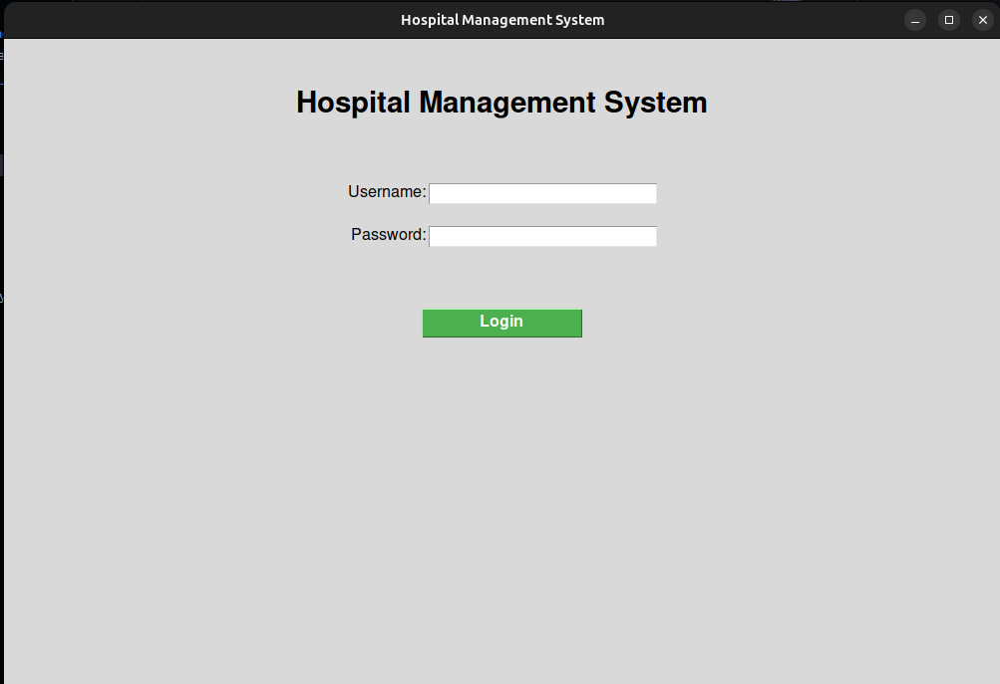
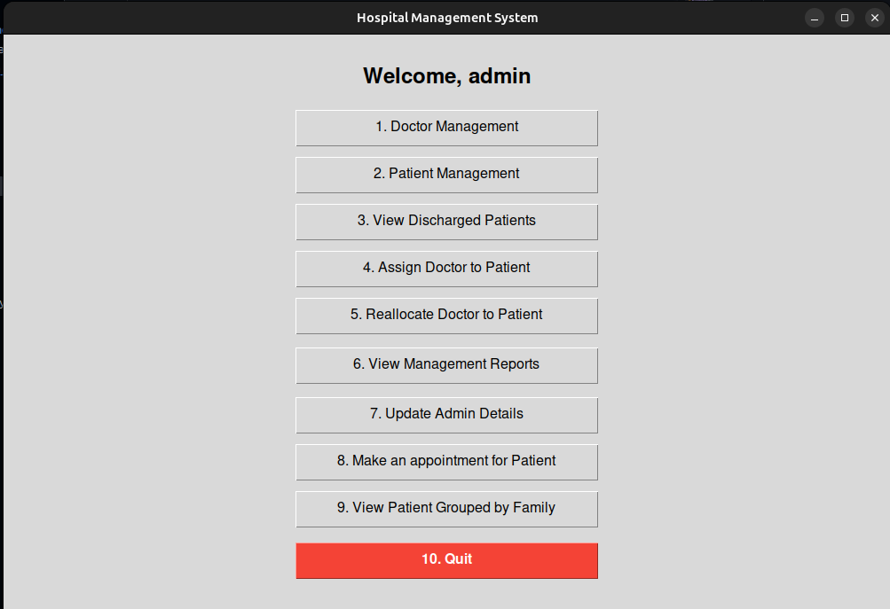
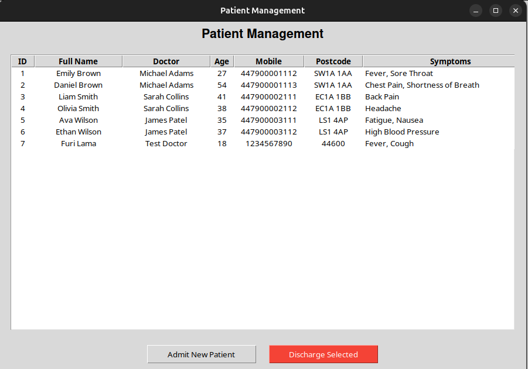
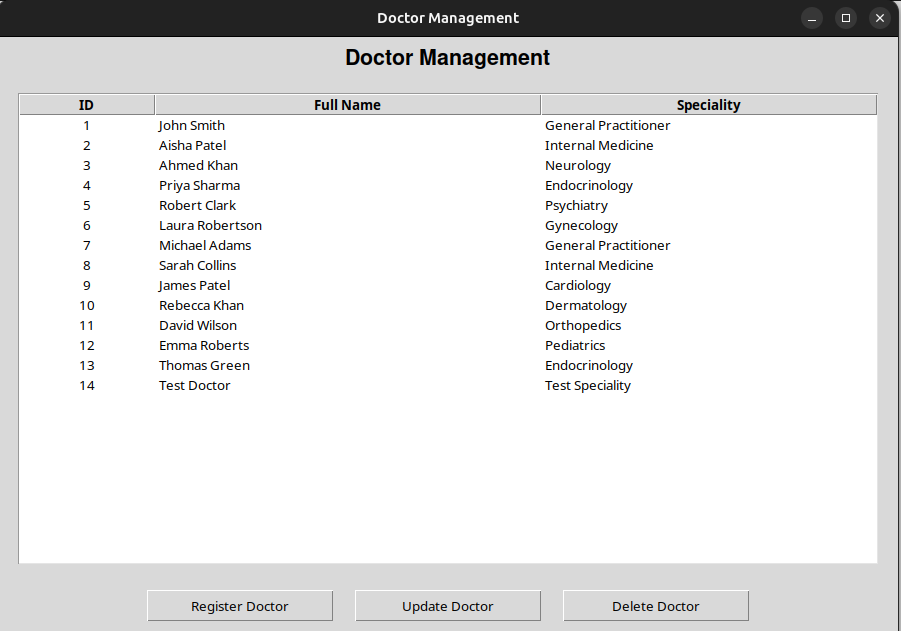
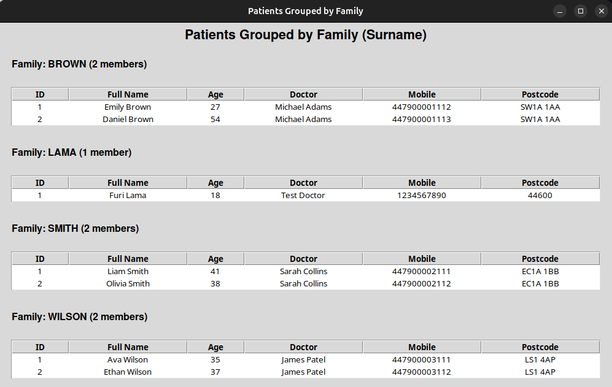
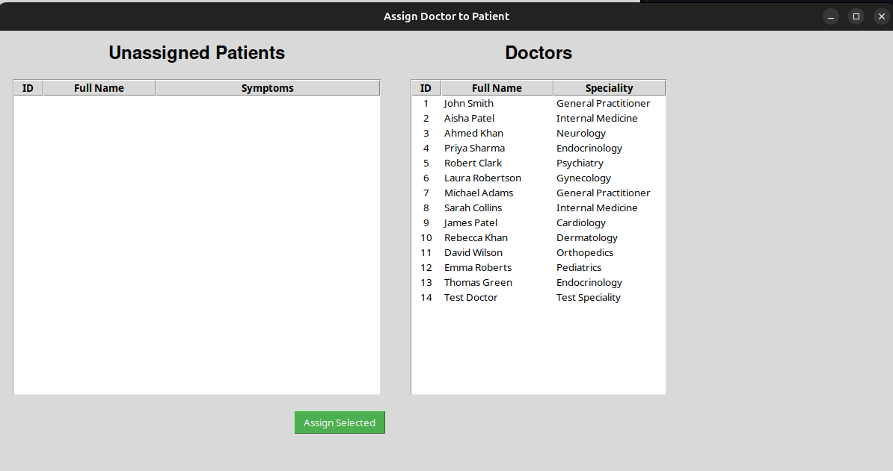

# 🏥 CMP4266-Final-Project-Hospital-Management-System

A comprehensive **Hospital Management System** built with **Python** and **Tkinter** (GUI) + console interface.  
Manages **doctors**, **patients**, **appointments**, **symptoms**, **discharged patients**, and **family grouping** — suitable for small to medium-sized clinics or educational projects.


## ✨ Features

- **Admin Login** with secure credentials
- **Doctor Management**  
  Register • View • Update • Delete doctors
- **Patient Management**  
  Admit • View • Discharge patients  
  Assign / Reassign doctor to patient
- **Symptoms Tracking**  
  Add/remove symptoms per patient  
  View patients grouped by illness/symptom type
- **Appointments** (Admin only)  
  Schedule appointments directly by admin  
  Stored both in file and in Doctor objects
- **Family Grouping**  
  View patients grouped by surname (family)
- **Discharged Patients** archive
- **Management Reports**  
  - Total doctors  
  - Patients per doctor  
  - Symptom/illness distribution  
  - (appointments per doctor – partial)
- **Persistent Data** using simple `.txt` files
- **Dual Interface**  
  - Modern Tkinter GUI  
  - Classic console (CLI) mode

## 🖥️ Screenshots

*(Add 3–5 real screenshots here when ready)*

| Login Screen                  | Main Menu                          | Patient Management                |
|-------------------------------|------------------------------------|-----------------------------------|
|     |       |   |

| Doctor Management                   | Family Grouping                    | Assign Doctor                  |
|-------------------------------|------------------------------------|-----------------------------------|
| |    |  |

## Installation
**1. Clone the repository:**

```
git clone https://github.com/lamafuri/CMP4266-Final-Project-Hospital-Management-System.git
```
**2. Navigate to the project directory**

```
cd CMP4266-Final-Project-Hospital-Management-System
```
**Ensure Python 3 is installed. No additional dependencies are required beyond standard libraries (e.g., Tkinter for GUI).**

## Running the Program
**1. For CLI:**

```
python Main.py
```
**2. For GUI:**

```
python GUI.py
```
**You can change the admin username and password from admin.txt or by running the program and going for option 7**
```
Username : admin
Password : 123
```

## Youtube Video Link
https://www.youtube.com/watch?v=Jrl68Gvkvg8&t=11s

## ⚠️ Academic Integrity Warning

🚫 **DO NOT COPY OR REUSE THIS CODE**

This repository is **strictly for personal learning and academic reference only**.

- Copying, sharing, or submitting this work (fully or partially) as your own  
- Reusing code in assessments without permission  
- Allowing others to copy this work  

⚠️ **Violates Birmingham City University academic regulations** and **Sunway Student Handbook rules** on:
- Plagiarism  
- Collusion  
- Academic Misconduct  

Such actions may result in **penalties, loss of marks, or disciplinary action**.

📌 Always submit **your own original work**.

---

## ✅ Declaration

I confirm that:
- This work is my own  
- It has been created for learning purposes only  
- I understand and comply with BCU academic regulations  

---

✨ *End of README*